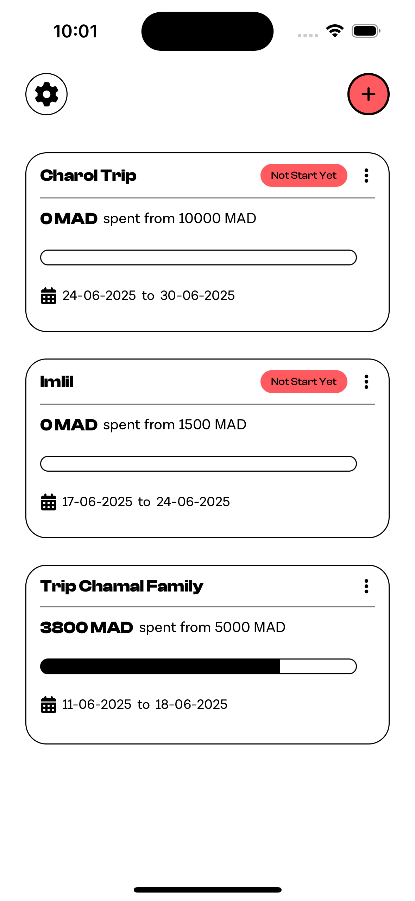
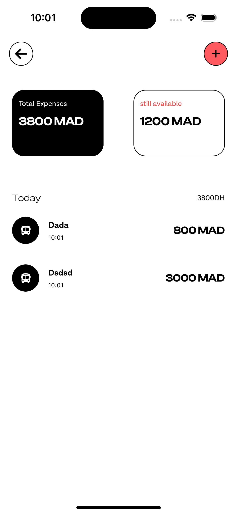
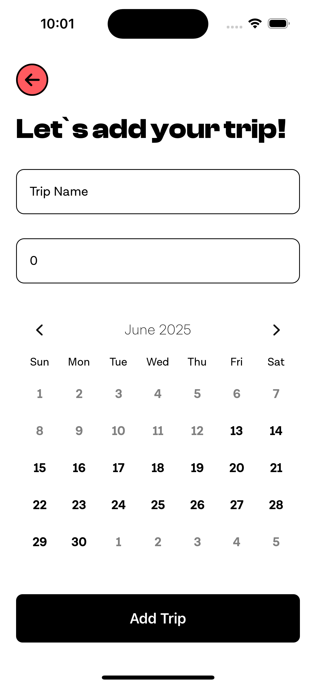
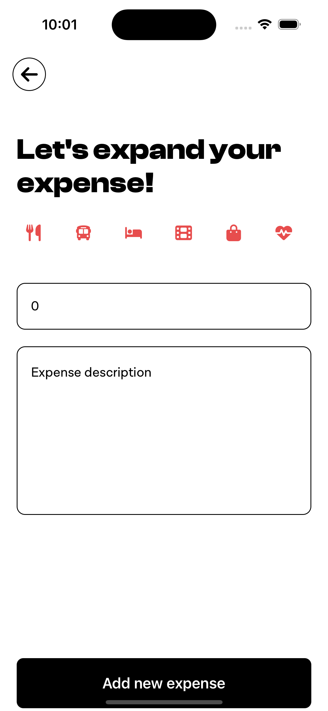
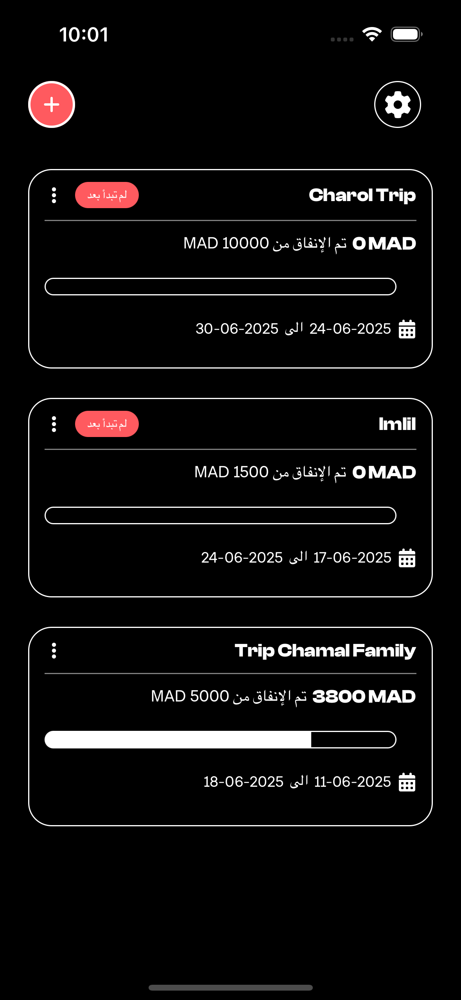

# AirSaver - Travel Budget Manager 🚀

**AirSaver** is a mobile app designed to help travelers efficiently **manage their travel budgets**, track expenses, and stay financially organized on trips. Inspired by **Airbnb's clean UI**, AirSaver provides a seamless and user-friendly experience.

## ✨ Features

- 📊 **Expense Tracking** – Log and categorize expenses easily
- 💰 **Budget Management** – Set spending limits for your trips
- 🌍 **Multi-Destination Support** – Track expenses across different locations
- 📱 **Modern UI** – Clean and minimal design inspired by Airbnb
- ⚡ **Built with React Native** – Fast and smooth mobile experience

## 🛠️ Tech Stack

- **React Native**
- **TypeScript**
- **Redux Toolkit**
- **React Navigation**

## 🚀 Getting Started

### 1️⃣ Clone the Repository

```bash
git clone https://github.com/mohamedkandad/airsaver.git
cd airsaver

```

## 📸 Screenshots



### 🏠 Trips Screen



### ✈️ New Trip Screen



### 💸 Expenses Screen



### 🏷️ New Expense Screen



## 🧑‍💻 About the Developer

Developed by Mohamed Kandad
🔗 Portfolio | 👨‍💻 GitHub
